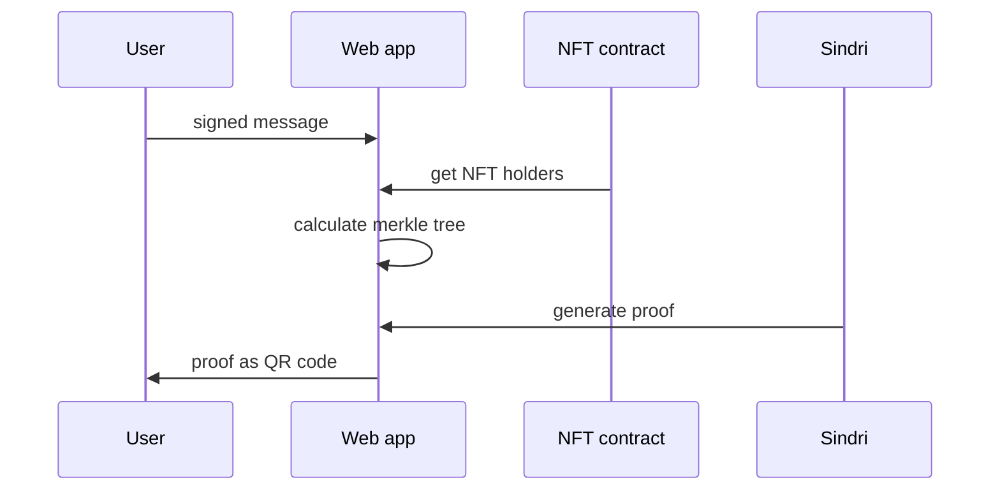
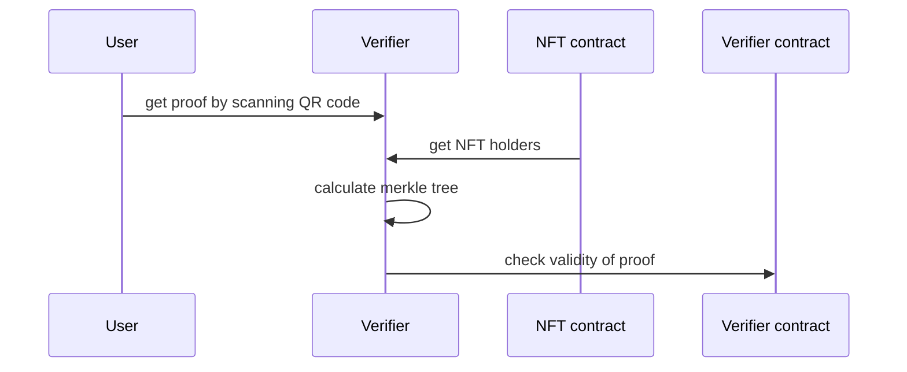
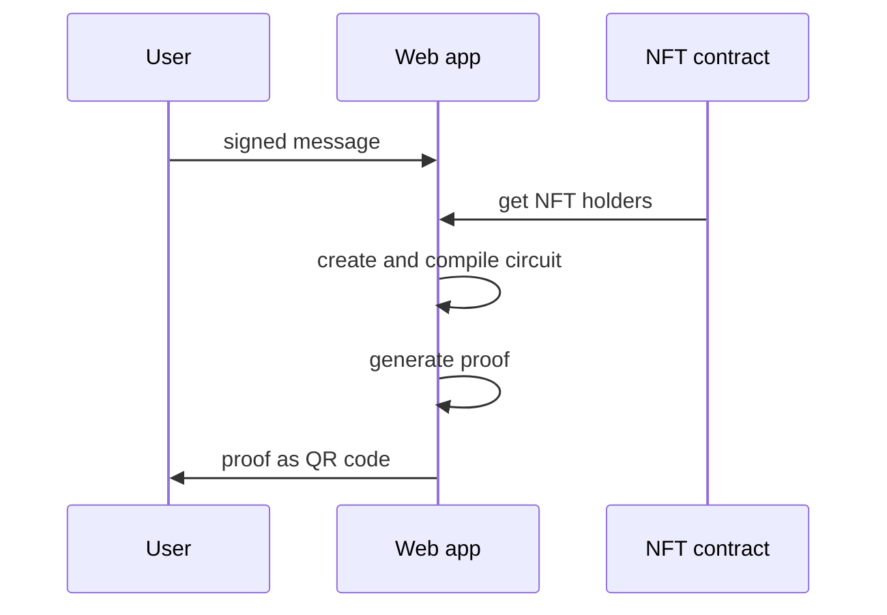

# Scrollpass 

Scrollpass is an adaptation of [Zupass](https://github.com/proofcarryingdata/zupass) for Scroll. The goal is to create a decentralized, permissionless and privacy-preserving version of Zupass' digital identity protocol, while maintaining a smooth and intuitive user experience. Currently with Zupass, provable data is tied to a user's profile and stored in a centralized database. Instead, we aim to process all user data locally on the client side, so that the the user directly shares proof of their identity with the verifier, forgoing any intermediary.

Our MVP is a private NFT ticketing app - where users can prove ownership of an NFT required for entry into an event in an anonymous manner.

## Version 1: Cloud proof generation

For a faster and more performant mobile experience, we created a version where proof generation is outsourced to [Sindri](https://sindri.app/), a cloud computing platform for zk circuits.proof generation is outsourced to [Sindri](https://sindri.app/), a cloud computing platform for zk circuits. This greatly reduces proof generation time, as the constraints of the mobile browser’s resources are no longer applicable.

The circuit checks two constraints: 1. ECDSA verification of user’s signature and 2. user is included in the list of NFT holders.

The list of NFT holders is queried from the contract and turned into a merkle tree. The merkle tree is sent to the circuit, which uses it to check inclusion of the user’s address. ECDSA verification of the user’s signature ensures that the user owns the address. The final proof generated is saved by the user in the form of a QR code.

When the user shares their QR code with the event organizer, who can also calculate the merkle tree of NFT holders, the validity of the proof can be verified on-chain.

Small note that the height of the merkle tree in the circuit must be predefined, which caps the number of leaves of the tree. For example, a merkle tree of height 10 can have at most 1024 distinct leaves, meaning it can handle an NFT contract with at most 1024 different owners.

Due to the use of Sindri, this implementation is not actually fully decentralized, as a third-party is being entrusted with the identity of the user.

The `GetProof` component is a button you can add to a `wagmi` enabled app to generate a proof using this flow, passing in the NFT address and an arbitrary message. You can verify the resulting proof using the same arbitrary message with the `verify` function in the `merklePath` file. Note that you will also first need to upload and compile the Noir circuit to your Sindri account under the `zupass-scroll` identifier.

## Version 2: 

To remove the use of Sindri and use Noir locally for proof generation, the circuits are simplified. Instead of using a merkle tree to to check the inclusion of the user’s address, the list of NFT holders is hard-coded into the circuit. Thus, a custom circuit is created for each NFT contract.

The `GetProofLocal` component is a button you can add to a `wagmi` enabled app to generate a proof using this flow, passing in the NFT address and an arbitrary message. You can verify the resulting proof with the same `verify` function in the `merklePath` file. This flow requires no Sindri setup as the circuit is compiled directly in the app.

# What’s Next?

Aside from event ticketing, this solution can also be adapted to other use cases such as token-gated chat groups or exclusive mints. 

Zupass and Scrollpass are both open-source projects, and we’re excited for developers in the community to iterate and use them as building blocks for other projects.